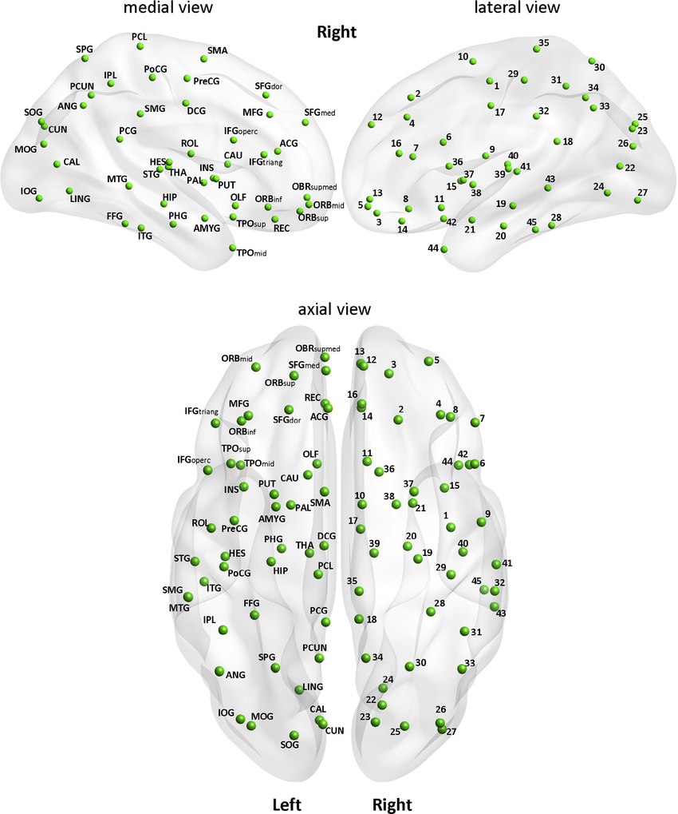
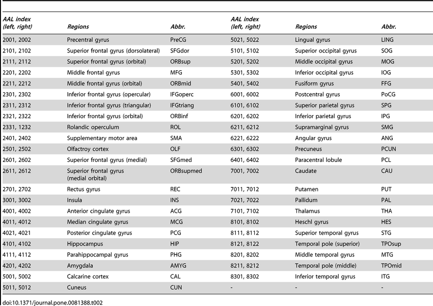

```{r setup, include=FALSE}
knitr::opts_chunk$set(echo = TRUE)
knitr::opts_chunk$set(cache = TRUE)
```

```{r include=FALSE}
load("./hw3_data.RData")
```

```{r include=FALSE}
# install.packages(latex2exp) if you haven't download the library
library(latex2exp)
```

$$~$$

# **Problem statement**

$$~$$

We are provided with some preprocessed data coming from *Autism Brain Image Data Exchange* Project. This dataset is partitioned in two subsets: the *Autism Spectrum Disorder* (**ASD**) and the *Typically Developed* (**TD**) sets. 

$$~$$


$$~$$

As shown in the image above, each subset contains the records of 12 patients. A sample of 145 records is associated to each person. Formally, this sample can be treated as an **IID** sample defined as:

$$
D^{(i)}_n = \{X_1, ..., X_n\} \sim f_X(\cdot) \hspace{1em} \text{ for a certain } f_X \text{, having } n=145
$$

Each $X_i$ is defined as a random vector $X_i = [X_i(1), ..., X_i(\mathtt{D})]^T \in \mathbb{R}^\mathtt{D}$, where $\mathtt{D}=116$ is the number of the features, i.e the number of the Regions of Interest (**ROIs**) of the person's brain. We also assume that each patient within a group can be himself treated as an **independent** sample from a certain $f_D(\cdot)$. Thus, moving bottom-up in the data tree, each group formally corresponds to:

$$
D_{12} = \{D^{(1)}_n, D^{(2)}_n, ..., D^{(12)}_n\}
$$

It is worth to note that the indipendence assumptions at the two levels of the data tree are quite crucial. Thanks to them, we have different ways of pooling the data:


1. Assume $D = \{X^{(1)}_1, ..., X^{(1)}_n, ..., X^{(12)}_1, ..., X^{(12)}_n\}$, that is ignoring the fact that each $X^{(i)}$ comes from different people.
2. Consider the estimator $\hat{D}_n = h\big(\{D^{(1)}_n, ..., D^{(12)}_n\}\big)$ for a certain function $h$.


From this point on, according to [[1]](#1), we follow the second approach, computing the correlation matrix $\big(\hat{\rho}_{j,k}\big)^{(i)} \in [-1,1]^{\mathtt{D}\times \mathtt{D}}$ associated to each $D^{(i)}_n$, $i=1,...,12$, and taking the mean of them; by the IID property of $\{D^{(1)}_n, ..., D^{(12)}_n\}$, we have that $\Big\{\big(\hat{\rho}_{j,k}\big)^{(i)}\Big\}_{i=1}^{12}$ is still independent, being function of each $D^{(i)}_n$. This choice has many advantages, which will be pointed out further in the discussion.<br><br>

As pointed out in [[2]](#2), the Pearson correlation coefficient is non-additive, then it is not mathematically meaningful to take the mean of them as they are. Hence, before averaging, we apply the Fisher Z-transform in order to smoothly map the interval $[-1,1]$ into $\mathbb{R}$:

$$
\Big\{\hat{Z}^{(i)}_{j,k}\Big\}_{i=1}^{12} = \Big\{atan\left(\hat{\rho}^{(i)}_{j,k}\right)\Big\}_{i=1}^{12} \hspace{1em} \text{where} \hspace{.5em} j,k \in \{1,...,\mathtt{D}\},\hspace{.4em} j\neq k
$$

Recall that, for each $\hat{Z}^{(i)}_{j,k}$, holds:

$$
\hat{Z}^{(i)}_{j,k} \hspace{.4em} \dot{\sim} \hspace{.4em}  N_1\Big(atan(\hat{\rho}^{(i)}_{j,k}), \frac{1}{n - 3}\Big), \hspace{1em} n=145
$$

Finally, we take:

$$
\overline{Z}_{12}(j,k) = \frac{1}{12}\sum_{i=1}^{12}\hat{Z}^{(i)}_{j,k} \text{ ,} 
$$

remembering that $\hat{Z}^{(i)}_{j,k}$ are $IID$, being function of $\hat{\rho}^{(i)}_{j,k}$.

Here the convenience of this approach becomes evident; indeed, being a sample mean, the estimator is unbiased under the assumption of an (unknown) identical distribution $f_D$; by the CLT, the sample mean is asymptotically normal so that:

$$
\frac{\overline{Z}_{12}(j,k) - Z_{j,k}}{\hat{\sigma}_{j,k}/\sqrt{12}} \hspace{.4em} \dot{\sim} \hspace{.4em} N(0,1),
$$
where $\hat{\sigma}_{j,k} = \frac{1}{\sqrt{145 - 3}}$. In building the asymptotic confidence interval for $Z_{j,k}$, these results reveal pretty relevant.<br><br>

Before moving forward, for the sake of completeness, we discuss the other possible pooling approaches.<br>
Concatenate the data related to all the patients within a group leads to:

$$
\hat{Z}^{(i)}_{j,k} \hspace{.4em} \dot{\sim} \hspace{.4em}  N_1\Big(atan(\hat{\rho}^{(i)}_{j,k}), \frac{1}{n - 3}\Big), \hspace{1em} n=145 \cdot 12,
$$

which is statistically more efficient than the chosen estimator. Nevertheless, in building the asymptotic confidence interval problems arise: if the distribution assumptions don't strongly hold, this approach is less robust than the chosen one.<br>
Eventually, taking the average of the patients before computing the correlation coefficients would hield to a more complicated and potentially less accurate solution. 

$$~$$

# **Data handling and transformation**

$$~$$

Before going any further, we verify the distribution of the average of the measurements for each patient inside a group:

$$~$$

```{r fig.width=10, fig.height=7, echo=FALSE}
par(mfrow = c(3,4))
print("ASD group")
for(i in 1:length(asd_sel)) {
  p.mu <- apply(asd_sel[[i]], 1, mean)
  plot(ecdf(p.mu), col = "skyblue3", main = paste("ECDF patient", i), xlab = "X")
  # plot(ecdf(p.mu), col = "orchid")
}
```

```{r fig.width=10, fig.height=7, echo=FALSE}
par(mfrow = c(3,4))
print("TD group")
for(i in 1:length(td_sel)) {
  p.mu <- apply(td_sel[[i]], 1, mean)
  plot(ecdf(p.mu), col = "orange3", main = paste("ECDF patient", i), xlab = "X")
  # plot(ecdf(p.mu), col = "orchid")
}
```

$$~$$


After loading the data, we define a function called **get.cor.ROIs()** in order to return a dataframe of correlations between all possible combinations between the ROIs. Inside this function we transform the correlation values with the Fisher Z-transform as defined in the previous section.

$$~$$

```{r}
# define a function in order to catch each person and return the correlation matrix between ROIs
get.cor.ROIs <- function(...){
  args <- list(...)
  
  if(!is.null(args[["person"]])) {
    args$frame <- args[["group"]][[args[["person"]]]]
  }
  
  n   <- ncol(args[["frame"]])
  nms <- names(args[["frame"]])
  
  # takes efficiently the combinations, this is useful for large dataset!
  V1  <- rep(nms[1:(n-1)], seq(from=n-1, to = 1, by = -1)) 
  V2  <- unlist(lapply(1:(n-1), function(i)(nms[(i+1):n])))
  
  corr.ROIs <- data.frame(ROI_1=V1, ROI_2=V2) # create the correlation in which I will insert the values
  
  corr.ROIs$z.pearson.corr <- apply(corr.ROIs, 1, function(row) {
    atanh(cor(args[["frame"]][row["ROI_1"]], args[["frame"]][row["ROI_2"]])) # takes the sets of columns; apply the Z-transform to the correlation matrix
  })
  
  return(corr.ROIs)
}
```

$$~$$

Recall, for these 12 people of each group, the function defined above. We put into the call function the type of group and the corresponding i-th person.

$$~$$

```{r}
# create the matrix correlations for all patients
for(person in names(asd_sel)) 
  assign(paste("z.trans.", person, sep=""), get.cor.ROIs(group = asd_sel, person = person))
for(person in names(td_sel)) 
  assign(paste("z.trans.", person, sep=""), get.cor.ROIs(group = td_sel, person = person))
```

$$~$$

After computing the correlation dataframes, for all the patients within each group, we pool the data as hinted at the beginning.

$$~$$

```{r}
# create a unique matrix for each group
unique.matrix <- function(group) {
  mtx <- z.trans.caltech_0051472[c("ROI_1", "ROI_2")] # create matrix with combinations
  
  mtx$cor.mean <- apply(mtx, 1, function(row) {
    values <- c()
    for(person in names(group)) {
       frame <- get(paste("z.trans.", person, sep="")) # match the address of the string with the real variable
       elem <- frame[(frame[["ROI_1"]] == row["ROI_1"]) & (frame[["ROI_2"]] == row["ROI_2"]), "z.pearson.corr"] # select the correlation
       values <- c(values, elem)
    }
    mean(values) # take the mean!
  })
  
  return(mtx)
}
```

$$~$$

We finally get the average correlation matrix for the groups ASD and TD:

$$~$$

```{r}
# call the creation of unique matrix
asd_sel.dt <- unique.matrix(asd_sel); head(asd_sel.dt)
td_sel.dt <- unique.matrix(td_sel); head(td_sel.dt)
```

$$~$$

# **Some plots**

$$~$$

Before computing the estimated association graphs, we show some plots to investigate the properties of the averaged correlation matrices associated to ASD and TD. According to the assignment introduction, two ROIs are strictly defined as co-activated if they are positively correlated: the greater the Pearson coefficient, the stronger the co-activation between them. Hence, the heatmaps below show the 80 most positively correlated ROIs within the two groups: 

```{r include=FALSE}
library(ggplot2)
library(hrbrthemes)

halfHeatmap <- function(x, title) {
  # Give extreme colors:
  xx <- x[order(x$cor.mean, decreasing = TRUE),][1:80,]
  return(ggplot(xx, aes(ROI_1, ROI_2, fill = cor.mean)) + 
    ggtitle(title) +
    geom_tile() +
    guides(fill = guide_legend(title = "Z-transformed correlation", title.position = "top")) + 
    scale_fill_gradient(low="pink", high="darkorchid4") +
    theme_minimal() +
    theme(axis.line = element_line(color = "gray", size = 1),
           
          axis.text.x = element_text(angle = 90, vjust = 0.5, hjust=1),
          plot.title = element_text(hjust = 0.5)
          ))
}
```

$$~$$

```{r fig.width=10, fig.height=8}
halfHeatmap(asd_sel.dt, title = "Top 80 positively correlated ROIs in ASD group (Z-scale)")
halfHeatmap(td_sel.dt, title = "Top 80 positively correlated ROIs in TD group (Z-scale)")
```

$$~$$
<div>
<center>
<a href="https://www.researchgate.net/profile/Jennifer-Ryan-5/publication/287360457/figure/fig2/AS:388527750696962@1469643642329/Distribution-of-90-regions-from-the-AAL-atlas-with-region-labels-on-the-left-side-and.png">

</a><br><br>
<p><strong>Image 1.</strong> AAL atlas.</p>
<br><br><br>

<a href="https://www.researchgate.net/profile/Yun_Xiong2/publication/259354957/figure/fig8/AS:341429713948692@1458414595899/Brain-regions-in-the-AAL-atlas.png">

</a><br><br>
<p><strong>Image 2.</strong> Table of ROIs' IDs and names.</p>
</center>
</div>

$$~$$

Looking at the plots and at the images above, it is evident that the majority of the co-activated ROIs have near positions in the brain. As an example, the ROIs named 5001 and 5002 are strongly positively correlated in both the groups.

$$~$$

Moving foreward, the histograms below show the distribution of the correlation coefficients in the Z-scale of the groups. 

$$~$$

```{r fig.width=10, fig.height=7, echo=FALSE}
par(mfrow=c(2,2))

hist(asd_sel.dt$cor.mean, probability = T, breaks = 50, col = "orange", main = "Distribution of correlations in ASD group", xlab = " mean", ylab = "count", border = "white"); rug(asd_sel.dt$cor.mean,col=rgb(.3,.3,.3,.1)); box()

hist(td_sel.dt$cor.mean, probability = T, breaks = 50, col = "steelblue", main = "Distribution of correlations in TD group", xlab = " mean", ylab = "count", border = "white"); rug(td_sel.dt$cor.mean,col=rgb(.3,.3,.3,.1)); box()

hist(asd_sel.dt$cor.mean, probability = T, breaks = 50, col = rgb(1,165/255,0,.8), main = "Distribution of correlations in ASD and TD group", xlab = " mean", ylab = "count", border = "white"); rug(asd_sel.dt$cor.mean,col=rgb(.3,.3,.3,.1))

hist(td_sel.dt$cor.mean, probability = T, breaks = 50, col = rgb(70/255,130/255,180/255,.8), border = "white", add = T); rug(td_sel.dt$cor.mean,col=rgb(.3,.3,.3,.1)); box()

hist(rbind(asd_sel.dt[["cor.mean"]], td_sel.dt[["cor.mean"]]), probability = T, breaks = 50, col = "purple", main = "Distribution of correlations in ASD+TD group", xlab = " mean", ylab = "count", border = "white"); rug(rbind(asd_sel.dt[["cor.mean"]], td_sel.dt[["cor.mean"]]),col=rgb(.3,.3,.3,.1)); box()
```

$$~$$

As expected, the values are approximately distributed as a Gaussian and the curve is slighly skewed on the left.

$$~$$

# **Association graphs**

$$~$$

Start to find the quantile value for these two groups. Since working on the Z-scale, the threshold is also in the Z-scale.

$$~$$

```{r}
z.t <- apply(rbind(asd_sel.dt["cor.mean"], td_sel.dt["cor.mean"]), 2, quantile, probs=0.8) 
paste("the threshold at the 80th percentile for the subjects is: ", round(as.numeric(z.t), 3), sep = "")
```

$$~$$

```{r fig.width=8, fig.height=6, echo=FALSE}
plot(ecdf(rbind(asd_sel.dt[,"cor.mean"], td_sel.dt[,"cor.mean"])), main = "ECDF of the Z-transformed correlation coefficient", xlab = TeX("$atan(\\rho)$"), ylab = TeX("$F(\\cdot)$"), col = "steelblue", lwd = 4); box(); grid()
abline(h = .8, col = "yellowgreen", lwd = 2, lty = 2)
text(x = z.t - .07, y = .83, labels = TeX("$z_t$"))
```

$$~$$

We compute the confidence interval for each $\overline{Z}_{12}(j,k)$. Starting from:

$$~$$


$$
\frac{\overline{Z}_{12}(j,k) - Z_{j,k}}{\hat{\sigma}_{j,k} / \sqrt{12}}, \\
\text{ where } \hat{\sigma}_{j,k} = \frac{1}{\sqrt{145 - 3}}
$$

$$~$$

and applying the **Bonferroni's correction**, this is one of the typical method used for the problem of **multiple comparisons**. Let $\textit{H}_{1}, ..., \textit{H}_{m}$ a collection of null hypotheses and the $\rho_{j, k}$ correlations values that we would want to compare to the alpha level (rejection region). The familywise error rate (FWER) is the probability to reject at least one true hypothesis $\textit{H}_{0}$, in this way I can commit the first type of error $\alpha$. In our case as we can see below, all is determined by the m (number of hypotheses): 

$$~$$

$$
\frac{\alpha}{m}, \hspace{1em} \text{ where } \hspace{.5em} m = \begin{pmatrix} \mathtt{D} \\ 2 \end{pmatrix}, \hspace{.5em} \mathtt{D}=116 
$$

$$~$$

we end up with:

$$~$$

$$
C_{12}^{Z(j,k)}\Big(\frac{\alpha}{m}\Big) = \bigg[\overline{Z}_{12}(j,k) \mp z_{\alpha/2m} \cdot \frac{\hat{\sigma}_{j,k}}{\sqrt{12}}\bigg]
$$

$$~$$

```{r}
conf.int <- function(dt, m = 1, alpha = 0.05) { # m : Family-Wise Error Rate correction (Bonferroni)
  # Asymptotic variance
  n.samp <- 145 # number of IID samples on which we computed the correlation matrix
  sigma <- 1 / sqrt(n.samp - 3) # standard deviation of the (j,k)-th Z-transformed Pearson coefficent 
  n.p <- 12 # number of people in each of the two groups
  se <- sigma / sqrt(n.p) # standard error of the estimator Z12
  
  # Confidence interval
  cint <- sapply(dt$cor.mean, function(z.i) {
    list(confidence_interval = c(lb = z.i - se * qnorm(1 - alpha / (2*m)), 
                                 ub = z.i + se * qnorm(1 - alpha / (2*m))))
  })
  return(cint)
}
```

$$~$$

Finally, the confidence intervals for the first three ROI couples are:

$$~$$

```{r}
## Compute the confidence interval
m <- (116 * 115) / 2 # number of intervals
asd_sel.dt$cint <- conf.int(asd_sel.dt, m = m); asd_sel.dt[1:3,]
td_sel.dt$cint <- conf.int(td_sel.dt, m = m); td_sel.dt[1:3,]
```

$$~$$

Since the threshold is $z_t=$ `r round(z.t, 3)` and two ROIs $j,k$ are considered connected if $[-z_t, z_t] \cap C_{12}^{Z(j,k)}\Big(\frac{\alpha}{m}\Big)=\emptyset$, we expect to have a connection in the estimated graph between `r asd_sel.dt[1,"ROI_1"]` and `r asd_sel.dt[1,"ROI_2"]`, whereas not to have a connection between `r asd_sel.dt[2,"ROI_1"]` and `r asd_sel.dt[2,"ROI_2"]`. 

$$~$$

Just as an example, we visualize the confidence interval for $Z(j=2001,k=2002)$ in the ASD and TD groups:

```{r include=FALSE}
plotCint <- function(ROI.1, ROI.2, dt, title) {
  hist(dt$cor.mean, probability = T, breaks = 50, col = "pink", main = title, xlab = " mean", ylab = "count", border = "deeppink")

  corresponding.interval <- function(ROI.1, ROI.2, group) {
    cint <- group[(group$ROI_1 == ROI.1) & (group$ROI_2 == ROI.2), "cint"]
    lb <- cint[[1]]["lb"]; ub <- cint[[1]]["ub"]
    estimate.corr <- group[(group$ROI_1 == ROI.1) & (group$ROI_2 == ROI.2), "cor.mean"]
    
    info <- list("lb" = lb, "ub" = ub, "cor.mean" = estimate.corr)
    return(info)
  } 
  
  cint <- corresponding.interval(ROI.1 = ROI.1, ROI.2 = ROI.2, dt)
  rect(cint$lb, -10, cint$ub, +10, border = NA, col = viridis::viridis(1, .3))
  points(cint$cor.mean, 0, col = "green", pch = 19)
  abline(v = cint$cor.mean, lwd = 3, col = viridis::viridis(1, .1))
  text(cint$cor.mean, 2, expression(hat(p)[mean]), pos = 4)
  rug(dt$cor.mean, col=rgb(.3,.3,.3,.1)); grid(); box()
}
```

```{r fig.width=10, fig.height=4, echo=FALSE}
par(mfrow=c(1,2))

# calling the function in order to see the confidence interval for the mean correlation between two ROIs
plotCint(ROI.1 = "2001", ROI.2 = "2002", asd_sel.dt, "Confidence interval of a data point - ASD") 
plotCint(ROI.1 = "2001", ROI.2 = "2002", td_sel.dt, "Confidence interval of a data point - TD")
```

$$~$$

At this point, we compute the estimated association graphs, applying the condition just mentioned. To be more precise, the (conservative) null hypothesis $H_0^{j,k}$ states that, under a certain threshold, the (Z-transformed) correlation coefficient $z_{j,k}$ is not relevant and thus ROIs $j,k$ are not correlated. The null hypothesis is hence rejected if and only if, at a certain level $\alpha$ of confidence, the correlation value is not in the threshold interval. In this case, ROIs $j,k$ are connected with an edge.

$$~$$

```{r}
## Estimate the adjacency matrix given the Z-transformed Pearson correlation coefficient 
get.est.adj.mat <- function(dt, dec.rule, t) {
  # create the adj matrix 
  nameVals <- sort(unique(unlist(dt[1:2]))) # set up storage matrix, get names for row and columns
  
  # construct 0 matrix of correct dimensions with row and column names 
  adj_mat <- matrix(0, length(nameVals), length(nameVals), dimnames = list(nameVals, nameVals))
  
  # fill in the matrix with matrix indexing on row and column names 
  adj_mat[as.matrix(dt[c("ROI_1", "ROI_2")])] <- 0
  
  # put edge according to the decision rule
  for(idx in rownames(dt)){
    if( dec.rule(dt, idx, t) ) {
      adj_mat[as.character(dt[idx, "ROI_1"]), as.character(dt[idx, "ROI_2"])] <- 1 
    }
  }
  
  return(adj_mat)
}


## check if the two intervals int1 and int2 are overlapping
are.joint <- function(int1, int2) return((int1[1] <= int2[2]) && (int2[1] <= int1[2]))


## check the simple threshold condition
check.threshold <- function(dt, idx, t) {
  val <- abs(dt[idx, "cor.mean"])
  return(val >= t)
}


## check the confidence interval condition
check.conf.int <- function(dt, idx, t) {
  c.int <- dt[idx, "cint"]$confidence_interval
  t.int <- c(-t, t)
  return(!are.joint(c.int, t.int))
}
```


$$~$$

```{r include=FALSE}
require(igraph, quietly = TRUE)
```

```{r}
# Adjacency matrix of the estimated graph with the Bonferroni's correction
adj_mat_asd_bonf <- get.est.adj.mat(asd_sel.dt, check.conf.int, z.t) 
adj_mat_td_bonf <- get.est.adj.mat(td_sel.dt, check.conf.int, z.t) 

# Estimated graph
G.asd.bonf <- graph_from_adjacency_matrix(adj_mat_asd_bonf, mode = "undirected")
G.td.bonf <- graph_from_adjacency_matrix(adj_mat_td_bonf, mode = "undirected")
```

$$~$$

```{r fig.width=10, fig.height=10, echo=FALSE}
# To plot the correlation graph(s)
plot(G.asd.bonf, vertex.size = 4, edge.width = .3, vertex.color = "orchid", label.col = "black", 
     main = "ASD Association Graph", sub = "(Bonferroni's multiplicity adjustment)",
     layout = layout.kamada.kawai, vertex.label.cex = 0.7, vertex.label.dist = .8)
```

$$~$$

```{r fig.width=10, fig.height=10, echo=FALSE}
plot(G.td.bonf, vertex.size = 4, edge.width = .3, vertex.color = "dodgerblue", label.col = "black", 
     main = "TD Association Graph", sub = "(Bonferroni's multiplicity adjustment)",
     layout = layout.kamada.kawai, vertex.label.cex = 0.7, vertex.label.dist = .8)
```

$$~$$

```{r fig.width=10, fig.height=10, echo=FALSE}
G.diff.bonf <- difference(G.asd.bonf, G.td.bonf)
plot(G.diff.bonf, vertex.size = 4, edge.width = .8, vertex.color = "orange", label.col = "black", 
     main = TeX("Co-activated ROIs in $(\\mathrm{G}^{ASD} - \\mathrm{G}^{TD})$"), sub = "(Bonferroni's multiplicity adjustment)",
     layout = layout.kamada.kawai, vertex.label.cex = 0.7, vertex.label.dist = .8)

```

$$~$$

The association graph taking into only the threshold is:

$$~$$

```{r}
# Adjacency matrix of the estimated graph with the Bonferroni's correction
adj_mat_asd_thr <- get.est.adj.mat(asd_sel.dt, check.threshold, z.t) 
adj_mat_td_thr <- get.est.adj.mat(td_sel.dt, check.threshold, z.t) 


# Estimated graph
G.asd.thr <- graph_from_adjacency_matrix(adj_mat_asd_thr, mode = "undirected")
G.td.thr <- graph_from_adjacency_matrix(adj_mat_td_thr, mode = "undirected")
```

$$~$$

Plot the graphs with the threshold, without adjustment:

$$~$$

```{r fig.width=10, fig.height=10, echo=FALSE}
plot(G.asd.thr, vertex.size = 4, edge.width = .3, vertex.color = "orchid", label.col = "black", 
     main = "ASD Association Graph", sub = "(Threshold only)",
     layout = layout.kamada.kawai, vertex.label.cex = 0.7, vertex.label.dist = .8)
plot(G.td.thr, vertex.size = 4, edge.width = .3, vertex.color = "dodgerblue", label.col = "black", 
     main = "TD Association Graph", sub = "(Threshold only)",
     layout = layout.kamada.kawai, vertex.label.cex = 0.7, vertex.label.dist = .8)
```

$$~$$

The association graph taking into account the confidence interval without the Bonferroni's correction is:

$$~$$

```{r}
# Recompute the confidence intervals without the multiplicity adjustment
asd_sel.dt$cint <- conf.int(asd_sel.dt, m = 1)
td_sel.dt$cint <- conf.int(td_sel.dt, m = 1)

# Adjacency matrix of the estimated graph with the Bonferroni's correction
adj_mat_asd_no_bonf <- get.est.adj.mat(asd_sel.dt, check.conf.int, z.t) 
adj_mat_td_no_bonf <- get.est.adj.mat(td_sel.dt, check.conf.int, z.t) 


# Estimated graph
G.asd.no.bonf <- graph_from_adjacency_matrix(adj_mat_asd_no_bonf, mode = "undirected")
G.td.no.bonf <- graph_from_adjacency_matrix(adj_mat_td_no_bonf, mode = "undirected")
```

$$~$$

Plot the graphs without Bonferroni's multiplicity adjustment:

$$~$$

```{r fig.width=10, fig.height=10, echo=FALSE}
plot(G.asd.no.bonf, vertex.size = 4, edge.width = .3, vertex.color = "orchid", label.col = "black", 
     main = "ASD Association Graph", sub = "(Without Bonferroni's multiplicity adjustment)",
     layout = layout.kamada.kawai, vertex.label.cex = 0.7, vertex.label.dist = .8)
plot(G.td.no.bonf, vertex.size = 4, edge.width = .3, vertex.color = "dodgerblue", label.col = "black", 
     main = "TD Association Graph", sub = "(Without Bonferroni's multiplicity adjustment)",
     layout = layout.kamada.kawai, vertex.label.cex = 0.7, vertex.label.dist = .8)
```

$$~$$

Let's check the number of edges of the estimated ASD graph:

$$~$$

```{r echo=FALSE}
paste("Number of edges considering only the threshold t: ", gsize(G.asd.thr))
paste("Number of edges with Bonferroni's correction: ", gsize(G.asd.bonf)) 
paste("Number of edges without Bonferroni's correction: ", gsize(G.asd.no.bonf))
```

$$~$$

Let's check the number of edges of the estimated TD graph:

$$~$$

```{r echo=FALSE}
paste("Number of edges considering only the threshold t: ", gsize(G.td.thr))
paste("Number of edges with Bonferroni's correction: ", gsize(G.td.bonf)) 
paste("Number of edges without Bonferroni's correction: ", gsize(G.td.no.bonf))
```

$$~$$

# **[BONUS] Bootstrap procedure and the difference graph**

$$~$$

Define the difference graph in order to create the boostrap samples, the difference graph is based on the difference between $$ \Big\|\triangle_{j,k}\Big\| = \Big\|{\rho}^{ASD}_{j,k} - {\rho}^{TD}_{j,k} \Big\|, \text{ having } j,k \in \{1,...,116\}, \text{ } j\neq k $$

$$~$$

```{r}
# Considering the two main datasets for these two groups, obtain the difference graph
mean.diff <- abs(asd_sel.dt[, 3] - td_sel.dt[, 3]) #  mean
diff.dt <- asd_sel.dt[, 1:2] 
diff.dt$cor.mean <- mean.diff
```

$$~$$

The threshold is considered as the 80% percentile as we saw before:

$$~$$


```{r}
z.diff.t <- apply(diff.dt["cor.mean"], 2, quantile, probs=0.8) 
paste("the threshold at the 80th percentile for the subjects is: ", round(as.numeric(z.diff.t), 3), sep = "")
```

$$~$$

Try to create the adjacency matrix considering the same threshold chose before:

$$~$$

```{r}
# Adjacency matrix of the estimated graph with only the threshold
adj_mat_diff_thr <- get.est.adj.mat(diff.dt, check.threshold, z.diff.t) 

# Estimated graph
G.diff.thr <- graph_from_adjacency_matrix(adj_mat_diff_thr, mode = "undirected")
```

$$~$$

Plot the graphs with the threshold, without adjustment:

$$~$$

```{r fig.width=10, fig.height=10}
plot(G.diff.thr, vertex.size = 4, edge.width = .3, vertex.color = "green", label.col = "black", 
     main = "Association Difference Graph", sub = "(Threshold only)",
     layout = layout.kamada.kawai, vertex.label.cex = 0.7, vertex.label.dist = .8)
```

$$~$$

Create the confidence interval with the non-parametric boostrap procedure, we are creating many times (B = 1000) different samples considering the binded dataset provided in the call function:

$$~$$

```{r}
## Concatenate the patients into one patient
concat.data <- function(dataset) {
  out <- dataset[[1]]
  for(i in 2:length(dataset)) out <- rbind(out, dataset[[i]])
  return(out)
}

## Non-parametric bootstrap
non.parametric.bootstrap <- function(data1, data2, B = 1000) {
  p.samples <- abs(atan(cor(data1)) - atan(cor(data2))) # we want to have the difference sample between our two correlations measure
  n <- ncol(p.samples) # counting the number of columns
  p.boot <- array(NA, dim = c(B, n, n)) # replicate a dataframe with dimensione (B, n, n)
  
  for(b in 1:B) {
    idx <- sample(1:n, n, replace = TRUE) # take n sample with replacement
    p.boot[b,,] <- abs(atan(cor(data1[idx,])) - atan(cor(data2[idx,]))) # inserting the i-th estimated pearson's correlation
  }
  return(list(p.samples = p.samples, p.boot = p.boot))
}
```

$$~$$

As hinted in the "Problem statement" section, since we assume the patients in each group as IID, we concatenate their measurments into a unique "patient": 

$$~$$

```{r}
asd_fusion <- concat.data(asd_sel)
td_fusion <- concat.data(td_sel)
```

$$~$$
We executed the boostrap procedure and calculate the normal boostrap confidence interval. After that, we considered to create the difference dataframe which associate also the confidence interval found before:

$$~$$

```{r fig.width=10, fig.height=7}

out.boot <- non.parametric.bootstrap(asd_fusion, td_fusion, B = 1000) # getting the boostrapped correlations samples

# Normal Bootstrap CI
alpha <- 0.05 # 95%, confidence level
m <- (116 * 115) / 2 # the number of hypotheses
mean.boot <- apply(out.boot$p.boot, 2:3, mean) # estimated mean
se.boot <- apply(out.boot$p.boot, 2:3, sd) # estimated standard deviation

feature.names <- colnames(asd_fusion) # extract the feature names
n <- length(feature.names) # get the number of features

# get the combinations between ROIs
V1  <- rep(feature.names[1:(n-1)], seq(from=n-1, to = 1, by = -1)) 
V2  <- unlist(lapply(1:(n-1), function(i)(feature.names[(i+1):n])))

diff.dt <- data.frame(list(ROI_1 = V1, ROI_2 = V2)) # create the dataframe with all possible combinations between ROIs
diff.dt$mean.boot <- as.vector(mean.boot[upper.tri(mean.boot, diag = F)]) # inserting the mean.boot into the difference dataframe
diff.dt$se.boot <- as.vector(se.boot[upper.tri(se.boot, diag = F)]) # inserting the se.boot into the difference dataframe

diff.dt$cint <- sapply(1:nrow(diff.dt), function(idx) { # insering the estimated CI boostrapped
    list(confidence_interval = c(lb = diff.dt$mean.boot[idx] - diff.dt$se.boot[idx] * qnorm(1 - alpha / (2*m)),
                                 ub = diff.dt$mean.boot[idx] + diff.dt$se.boot[idx] * qnorm(1 - alpha / (2*m))))
})
```

$$~$$

We calculate the estimated adjacency matrix as we can see before and convert it into a graph:

$$~$$

```{r}
# Adjacency matrix of the estimated graph with only the threshold
adj_mat_diff_boot <- get.est.adj.mat(diff.dt, check.conf.int, z.diff.t) 

# Estimated graph
G.diff.boot.bonf <- graph_from_adjacency_matrix(adj_mat_diff_boot, mode = "undirected")
```

$$~$$

Finally, shows the last plot. We can see the association difference graph based on the difference defined before:

$$~$$

```{r fig.width=10, fig.height=10}
plot(G.diff.boot.bonf, vertex.size = 4, edge.width = .3, vertex.color = "skyblue", label.col = "black", 
     main = "Association Difference Graph", sub = "(Bonferroni's multiplicity adjustment)",
     layout = layout.kamada.kawai, vertex.label.cex = 0.7, vertex.label.dist = .8)
```

$$~$$

Let's check the number of edges of the estimated Difference graph:

$$~$$

```{r echo=FALSE}
paste("Number of edges considering only the threshold t: ", gsize(G.diff.thr))
paste("Number of edges with Bonferroni's correction: ", gsize(G.diff.boot.bonf)) 
```

$$~$$

# References

$$~$$

<span id=1>[1]</span> David M. Corey, William P. Dunlap & Michael J. Burke (1998) Averaging Correlations: Expected Values and Bias in Combined Pearson rs and Fisher's z Transformations, The Journal of General Psychology, 125:3, 245-261, DOI: 10.1080/00221309809595548
<br><br>
<span id=2>[2]</span> Garcia, Edel. (2016). The Self-Weighting Model Tutorial: Part 1. 

$$~$$

