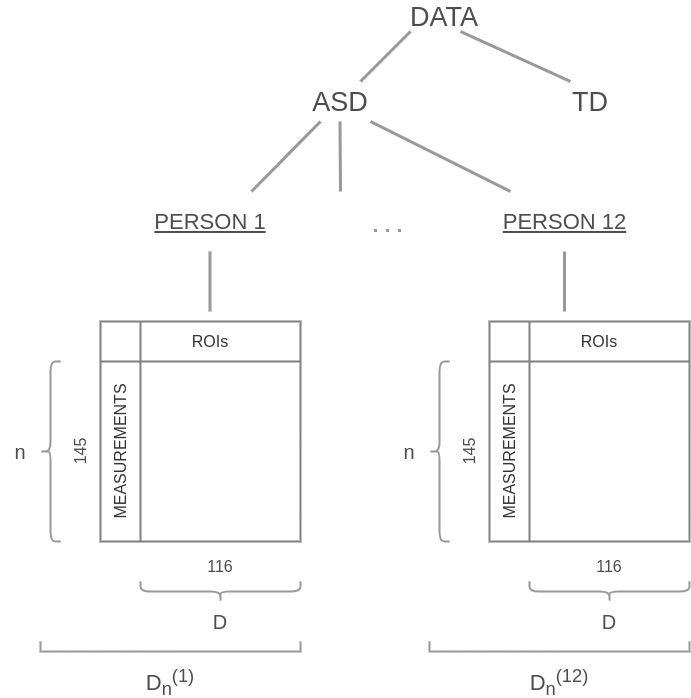

```{r setup, include=FALSE}
knitr::opts_chunk$set(echo = TRUE)
knitr::opts_chunk$set(cache = TRUE)
```

```{r include=FALSE}
load("./hw3_data.RData")
```

$$~$$

# Problem statement

$$~$$

We are provided with some preprocessed data coming from *Autism Brain Image Data Exchange* Project. This dataset is partitioned in two subsets: the *Autism Spectrum Disorder* (**ASD**) and the *Typically Developed* (**TD**) sets. 

$$~$$



$$~$$

As shown in the image above, each subset contains the records of 12 patients. A sample of 145 records is associated to each person. Formally, this sample can be treated as an **IID** sample defined as:

$$
D^{(i)}_n = \{X_1, ..., X_n\} \sim f_X(\cdot) \text{ for a certain } f_X \text{, having } n=145
$$
Each $X_i$ is defined as a random vector $X_i = [X_i(1), ..., X_i(D)]^T \in \mathbb{R}^D$, where $D=116$ is the number of the features, i.e the number of the Regions of Interest (**ROI**) of the person's brain. We also assume that each patient within a group can be himself treated as an **IID** sample from a certain $f_D(\cdot)$. Thus, moving bottom-up in the data tree, each group formally corresponds to:

$$
D_n = \{D^{(1)}_n, D^{(2)}_n, ..., D^{(12)}_n\}
$$
It is worth to note that the **IID** assumptions at the two levels of the data tree are quite crucial. Thanks to them, we have different ways of pooling the data:


1. Assume $D_n = \{X^{(1)}_1, ..., X^{(1)}_n, ..., X^{(12)}_1, ..., X^{(12)}_n\}$, that is ignoring the fact that each $X^{(i)}$ comes from different people.
2. Consider the estimator $\hat{D}_n = h\big(\{D^{(1)}_n, ..., D^{(12)}_n\}\big)$ for a certain function $h$.


At this point, we decide to follow the second approach, computing the covariance matrix $\hat{\Sigma}^{(i)}$ associated to each $D^{(i)}_n$, $i=1,...,12$, and taking the mean of them; by the IID property of $\{D^{(1)}_n, ..., D^{(12)}_n\}$, we have that $\big\{\hat{\Sigma}^{(i)}\big\}_{i=1}^{12}$ is still IID, being function of each $D_n$. This choice has many advantages, which will be pointed out further in the discussion.

$$~$$

# Data handling

$$~$$

After loading the data provided by the professor, create the covariance matrix for each patient; Z-scale this matrix through the Fisher's Z-transform and after that create a unique matrix per group considering the olympic mean by $X_n = (x_1, ... , x_{12})$ for each element in the matrix.

$$~$$

```{r}
# define a function in order to catch each person and return the correlation matrix between ROIs
get.cor.ROIs <- function(group, person){
  frame <- group[[person]]
  
  n   <- ncol(frame)
  nms <- names(frame)
  
  # takes efficiently the combinations, this is useful for large dataset!
  V1  <- rep(nms[1:(n-1)], seq(from=n-1, to = 1, by = -1)) 
  V2  <- unlist(lapply(1:(n-1), function(i)(nms[(i+1):n])))
  
  corr.ROIs <- data.frame(ROI_1=V1, ROI_2=V2) # create the correlation in which I will insert the values
  
  corr.ROIs$z.pearson.corr <- apply(corr.ROIs, 1, function(row) {
    atanh(cor(frame[row["ROI_1"]], frame[row["ROI_2"]])) # takes the sets of columns; apply the Z-transform to the
                                                          # correlation matrix
  })
  
  return(corr.ROIs)
}
```

$$~$$

Now, for each group create for each corresponding patient the matrix of correlations in the Z-scale.

$$~$$

```{r}
# create the matrix correlations for all patients
for(person in names(asd_sel)) assign(paste("z.trans.", person, sep=""), get.cor.ROIs(asd_sel, person))
for(person in names(td_sel)) assign(paste("z.trans.", person, sep=""), get.cor.ROIs(td_sel, person))
```

$$~$$

After that, we pooled the data considering the olympic mean between these datasets for each group, this is due to .... ecccccc

$$~$$

```{r}
# create a unique matrix for each group
unique.matrix <- function(group) {
  mtx <- z.trans.caltech_0051472[c("ROI_1", "ROI_2")] # create matrix with combinations
  
  mtx$olymp.mean <- apply(mtx, 1, function(row) {
  values <- c()
  for(person in names(group)) {
     frame <- get(paste("z.trans.", person, sep="")) # match the address of the string with the real variable
     elem <- frame[(frame[["ROI_1"]] == row["ROI_1"]) & (frame[["ROI_2"]] == row["ROI_2"]), "z.pearson.corr"] # select the correlation
     values <- c(values, elem)
  }
    #values <- values[values != min(values)]; values <- values[values != max(values)] # remove the min and max, we have continuous values, so the prob. to have twice the min or max is impossible..
    mean(values) # take the mean!
  })
  
  return(mtx)
}
```

$$~$$

Now, we call and create the matrix for each group of people as in this way:

$$~$$

```{r}
# call the creation of unique matrix
asd_sel.dt <- unique.matrix(asd_sel); head(asd_sel.dt)
td_sel.dt <- unique.matrix(td_sel); head(td_sel.dt)
```

$$~$$

# Some plots

$$~$$

```{r}
library(ggplot2)
library(hrbrthemes)

halfHeatmap <- function(x) {
  # Give extreme colors:
  return(ggplot(x, aes(ROI_1, ROI_2, fill = olymp.mean)) + 
    geom_tile() +
    scale_fill_gradient(low="white", high="blue") +
    theme_minimal() +
    theme(panel.grid = element_blank()))
}

halfHeatmap(asd_sel.dt)
```

$$~$$

```{r}
halfHeatmap(td_sel.dt)
```

$$~$$

```{r fig.width=10, fig.height=7}
hist(asd_sel.dt$olymp.mean, probability = T, breaks = 50, col = "orange", main = "Histogram of ASD group", xlab = "olympic mean", ylab = "count", border = "white")
```

$$~$$

```{r fig.width=10, fig.height=7}
hist(td_sel.dt$olymp.mean, probability = T, breaks = 50, col = "steelblue", main = "Histogram of TD group", xlab = "olympic mean", ylab = "count", border = "white")
```

$$~$$

```{r fig.width=10, fig.height=7}
hist(rbind(asd_sel.dt[["olymp.mean"]], td_sel.dt[["olymp.mean"]]), probability = T, breaks = 50, col = "purple", main = "Histogram of ASD+TD group", xlab = "olympic mean", ylab = "count", border = "white")
```

$$~$$

# Association graphs

$$~$$

Start to find the quantile value for these two groups. Since working on the Z-scale, the threshold is also in the Z-scale.

$$~$$

```{r}
z.t <- apply(rbind(asd_sel.dt["olymp.mean"], td_sel.dt["olymp.mean"]), 2, quantile, probs=0.8) 
paste("the threshold at the 80th percentile for the subjects is: ", round(as.numeric(z.t), 3), sep = "")
```

$$~$$

We compute the confidence interval for $\bar{Z}_{12}(j,k)$. Remember that we started computing the estimate of the covariance matrix for each person in each of the two groups, having:

$$
\Big\{\hat{\rho}^{(i)}_{j,k}\Big\}_{i=1}^{12}, \text{ having } j,k \in \{1,...,116\}, \text{ } j\neq k
$$

Then, we applied the Fisher's Z-transform:

$$
\Big\{\hat{Z}^{(i)}_{j,k}\Big\}_{i=1}^{12} = \Big\{atan\left(\hat{\rho}^{(i)}_{j,k}\right)\Big\}_{i=1}^{12}
$$


Finally, we computed the estimator:

$$
\overline{Z}_{12}(j,k) = \frac{1}{12}\sum_{i=1}^{12}\hat{Z}^{(i)}_{j,k} \text{ ,} 
$$

$$~$$

remembering that $\hat{Z}^{(i)}_{j,k}$ are $IID$, being function of $\hat{\rho}^{(i)}_{j,k}$, respectively.

Now, we calculate the confidence interval for each $\overline{Z}_{12}(j,k)$. Starting from:

$$~$$

$$
\frac{\overline{Z}_{12}(j,k) - z_{j,k}}{\sigma_{j,k} / \sqrt{12}}, \\ 
\text{ where } \sigma_{j,k} = \frac{1}{\sqrt{145 - 3}}
$$

and applying the Bonferroni's correction:

$$
\frac{\alpha}{m}, \text{ where } m = \begin{pmatrix} D \\ 2 \end{pmatrix}, \text{ } D=116 
$$

$$~$$

we end up with:

$$~$$

$$
C_{12}^{Z(j,k)}\Big(\frac{\alpha}{m}\Big) = \bigg[\overline{Z}_{12}(j,k) \mp z_{\alpha/2m} \cdot \frac{\sigma_{j,k}}{\sqrt{12}}\bigg]
$$

$$~$$

```{r}
conf.int <- function(dt, m = 1) { # m : Family-Wise Error Rate correction (Bonferroni)
  # Asymptotic variance
  n.samp <- 145 # number of IID samples on which we computed the covariance matrix
  sigma <- 1 / sqrt(n.samp - 3) # standard deviation of the (j,k)-th Z-transformed Pearson coefficent 
  n.p <- 12 # number of people in each of the two groups
  se <- sigma / sqrt(n.p) # standard error of the estimator Z12
  
  # Confidence interval - Setup
  alpha <- 0.05 # confidence level WITHOUT the Bonferroni's correction
  
  # Confidence interval
  cint <- sapply(dt$olymp.mean, function(z.i) {
    list(confidence_interval = c(lb = z.i - se * qnorm(1 - alpha / (2*m)), 
           ub = z.i + se * qnorm(1 - alpha / (2*m))))
  })
  return(cint)
}
```

$$~$$

Finally:

$$~$$

```{r}
## Compute the confidence interval
m <- (116 * 115) / 2 # number of intervals
asd_sel.dt$cint <- conf.int(asd_sel.dt, m); asd_sel.dt$cint[1:3]
td_sel.dt$cint <- conf.int(td_sel.dt, m); td_sel.dt$cint[1:3]
```

$$~$$

Show an example of confidence interval between two ROIs:

$$~$$

```{r fig.width=10, fig.height=7}
plotCint <- function(ROI.1, ROI.2, dt) {
  hist(dt$olymp.mean, probability = T, breaks = 50, col = "pink", main = "Interval of a data point", xlab = "olympic mean", ylab = "count", border = "deeppink")

  corresponding.interval <- function(ROI.1, ROI.2, group) {
    cint <- group[(group$ROI_1 == ROI.1) & (group$ROI_2 == ROI.2), "cint"]
    lb <- cint[[1]]["lb"]; ub <- cint[[1]]["ub"]
    estimate.corr <- group[(group$ROI_1 == ROI.1) & (group$ROI_2 == ROI.2), "olymp.mean"]
    
    info <- list("lb" = lb, "ub" = ub, "olymp.mean" = estimate.corr)
    return(info)
  } 
  
  cint <- corresponding.interval(ROI.1 = ROI.1, ROI.2 = ROI.2, dt)
  rect(cint$lb, -10, cint$ub, +10, border = NA, col = viridis::viridis(1, .3))
  points(cint$olymp.mean, 0, col = "green", pch = 19)
  abline(v = cint$olymp.mean, lwd = 3, col = viridis::viridis(1, .1))
  text(cint$olymp.mean, 2, expression(hat(p)[olymp]), pos = 4)
}

plotCint(ROI.1 = "2001", ROI.2 = "2002", asd_sel.dt)
```

$$~$$

```{r fig.width=10, fig.height=7}
plotCint(ROI.1 = "2001", ROI.2 = "2002", td_sel.dt)
```

$$~$$

We are now ready to estimate the adjacency matrix of the association graphs:

$$~$$

```{r}
## Estimate the adjacency matrix given the Z-transformed Pearson correlation coefficient 
get.est.adj.mat <- function(dt, dec.rule, t) {
  # create the adj matrix 
  nameVals <- sort(unique(unlist(dt[1:2]))) # set up storage matrix, get names for row and columns
  
  # construct 0 matrix of correct dimensions with row and column names 
  adj_mat <- matrix(0, length(nameVals), length(nameVals), dimnames = list(nameVals, nameVals))
  
  # fill in the matrix with matrix indexing on row and column names 
  adj_mat[as.matrix(dt[c("ROI_1", "ROI_2")])] <- 0
  
  # put edge according to the decision rule
  # TODO: SUBSTITUTE THE FOR LOOP WITH A MORE EFFICIENT SOLUTION
  for(idx in rownames(dt)){ 
    if( dec.rule(dt, idx, t) ) {
      adj_mat[as.character(dt[idx, "ROI_1"]), as.character(dt[idx, "ROI_2"])] <- 1 
    } 
  }
  
  return(adj_mat)
}


## check if the two intervals int1 and int2 are overlapping
are.joint <- function(int1, int2) return((int1[1] <= int2[2]) && (int2[1] <= int1[2]))


## check the simple threshold condition
check.threshold <- function(dt, idx, t) {
  val <- abs(dt[idx, "olymp.mean"])
  return(val >= t)
}


## check the confidence interval condition
check.conf.int <- function(dt, idx, t) {
  c.int <- dt[idx, "cint"]$confidence_interval
  t.int <- c(-t, t)
  return(!are.joint(c.int, t.int))
}
```


$$~$$

The association graph taking into account the confidence interval with the Bonferroni's correction is:

$$~$$

```{r}
require(igraph, quietly = TRUE)

# Adjacency matrix of the estimated graph with the Bonferroni's correction
adj_mat_asd_bonf <- get.est.adj.mat(asd_sel.dt, check.conf.int, z.t) 
adj_mat_td_bonf <- get.est.adj.mat(td_sel.dt, check.conf.int, z.t) 


# Estimated graph
G.asd.bonf <- graph_from_adjacency_matrix(adj_mat_asd_bonf, mode = "undirected")
G.td.bonf <- graph_from_adjacency_matrix(adj_mat_td_bonf, mode = "undirected")
```

$$~$$

Plot the graphs with the threshold, with Bonferroni's multiplicity adjustment:

$$~$$

```{r fig.width=10, fig.height=10}
# To plot the correlation graph(s)
plot(G.asd.bonf, vertex.size = 4, edge.width = .3, vertex.color = "orchid", label.col = "black", 
     main = "ASD Association Graph", sub = "(Bonferroni's multiplicity adjustment)",
     layout = layout.kamada.kawai, vertex.label.cex = 0.7, vertex.label.dist = .8)
plot(G.td.bonf, vertex.size = 4, edge.width = .3, vertex.color = "dodgerblue", label.col = "black", 
     main = "TD Association Graph", sub = "(Bonferroni's multiplicity adjustment)",
     layout = layout.kamada.kawai, vertex.label.cex = 0.7, vertex.label.dist = .8)
```

$$~$$

The association graph taking into only the threshold is:

$$~$$

```{r}
# Adjacency matrix of the estimated graph with the Bonferroni's correction
adj_mat_asd_thr <- get.est.adj.mat(asd_sel.dt, check.threshold, z.t) 
adj_mat_td_thr <- get.est.adj.mat(td_sel.dt, check.threshold, z.t) 


# Estimated graph
G.asd.thr <- graph_from_adjacency_matrix(adj_mat_asd_thr, mode = "undirected")
G.td.thr <- graph_from_adjacency_matrix(adj_mat_td_thr, mode = "undirected")
```

$$~$$

Plot the graphs with the threshold, without adjustment:

$$~$$

```{r fig.width=10, fig.height=10}
plot(G.asd.thr, vertex.size = 4, edge.width = .3, vertex.color = "orchid", label.col = "black", 
     main = "TD Association Graph", sub = "(Threshold only)",
     layout = layout.kamada.kawai, vertex.label.cex = 0.7, vertex.label.dist = .8)
plot(G.td.thr, vertex.size = 4, edge.width = .3, vertex.color = "dodgerblue", label.col = "black", 
     main = "TD Association Graph", sub = "(Threshold only)",
     layout = layout.kamada.kawai, vertex.label.cex = 0.7, vertex.label.dist = .8)
```

$$~$$

The association graph taking into account the confidence interval without the Bonferroni's correction is:

$$~$$

```{r}
# Recompute the confidence intervals without the multiplicity adjustment
asd_sel.dt$cint <- conf.int(asd_sel.dt, m = 1)
td_sel.dt$cint <- conf.int(td_sel.dt, m = 1)

# Adjacency matrix of the estimated graph with the Bonferroni's correction
adj_mat_asd_no_bonf <- get.est.adj.mat(asd_sel.dt, check.conf.int, z.t) 
adj_mat_td_no_bonf <- get.est.adj.mat(td_sel.dt, check.conf.int, z.t) 


# Estimated graph
G.asd.no.bonf <- graph_from_adjacency_matrix(adj_mat_asd_no_bonf, mode = "undirected")
G.td.no.bonf <- graph_from_adjacency_matrix(adj_mat_td_no_bonf, mode = "undirected")
```

$$~$$

Plot the graphs without Bonferroni's multiplicity adjustment:

$$~$$

```{r fig.width=10, fig.height=10}
plot(G.asd.no.bonf, vertex.size = 4, edge.width = .3, vertex.color = "orchid", label.col = "black", 
     main = "TD Association Graph", sub = "(Without Bonferroni's multiplicity adjustment)",
     layout = layout.kamada.kawai, vertex.label.cex = 0.7, vertex.label.dist = .8)
plot(G.td.no.bonf, vertex.size = 4, edge.width = .3, vertex.color = "dodgerblue", label.col = "black", 
     main = "TD Association Graph", sub = "(Without Bonferroni's multiplicity adjustment)",
     layout = layout.kamada.kawai, vertex.label.cex = 0.7, vertex.label.dist = .8)
```

$$~$$

Let's check the number of edges of the estimated ASD graph:

$$~$$

```{r}
paste("Number of edges considering only the threshold t: ", gsize(G.asd.thr))
paste("Number of edges with Bonferroni's correction: ", gsize(G.asd.bonf)) 
paste("Number of edges without Bonferroni's correction: ", gsize(G.asd.no.bonf))
```

$$~$$

# [BONUS] Boostrap procedure and the difference graph

$$~$$

Define the difference graph in order to create the boostrap samples, the difference graph is based on the difference between $$ \Big\|\triangle_{j,k}\Big\| = \Big\|{\rho}^{ASD}_{j,k} - {\rho}^{TD}_{j,k} \Big\|, \text{ having } j,k \in \{1,...,116\}, \text{ } j\neq k $$

$$~$$


```{r}
# Considering the two main datasets for these two groups, obtain the difference graph
olymp.diff <- abs(asd_sel.dt[, 3] - td_sel.dt[, 3]) # olympic mean
diff.dt <- asd_sel.dt[, 1:2] 
diff.dt$olymp.mean <- olymp.diff
```

$$~$$

The threshold is considered as the 80% percentile as we saw before:

```{r}
z.diff.t <- apply(diff.dt["olymp.mean"], 2, quantile, probs=0.8) 
paste("the threshold at the 80th percentile for the subjects is: ", round(as.numeric(z.diff.t), 3), sep = "")
```

$$~$$

Try to create the adjacency matrix considering the same threshold chose before:

```{r}
# Adjacency matrix of the estimated graph with only the threshold
adj_mat_diff_thr <- get.est.adj.mat(diff.dt, check.threshold, z.diff.t) 

# Estimated graph
G.diff.thr <- graph_from_adjacency_matrix(adj_mat_diff_thr, mode = "undirected")
```

$$~$$

Plot the graphs with the threshold, without adjustment:

```{r fig.width=10, fig.height=10}
plot(G.diff.thr, vertex.size = 4, edge.width = .3, vertex.color = "green", label.col = "black", 
     main = "Association Difference Graph", sub = "(Threshold only)",
     layout = layout.kamada.kawai, vertex.label.cex = 0.7, vertex.label.dist = .8)
```

$$~$$

Create the confidence interval with the boostrap procedure:

```{r}

non.parametric.bootstrap <- function(...) {
  args <- list(...)
  B <- args[["B"]]
  p.boot <- rep(NA, B)
  if(!is.null(args[["diff.dt"]])) {
    p.samples <- args[["diff.dt"]]$olymp.mean
    n <- nrow(args[["diff.dt"]])
    for(b in 1:B) {
      idx <- sample(1:length(p.samples), length(p.samples), replace = TRUE)
      p.boot[b] <- mean(p.samples[idx])
    }
    return(list(p.samples = p.samples, p.boot = p.boot))
  }
  else {
    p.samples <- abs(args[["asd_sel.dt"]][, 3] - args[["td_sel.dt"]][, 3])
    n <- nrow(p.samples)
    for(b in 1:B) {
      idx <- sample(1:length(p.samples), length(p.samples), replace = TRUE)
      p.boot[b] <- mean(abs(args[["asd_sel.dt"]][, 3][idx] - args[["td_sel.dt"]][, 3][idx]))
    }
    return(list(p.samples = p.samples, p.boot = p.boot))
  }
}


```


```{r fig.width=10, fig.height=7}

out.boot <- non.parametric.bootstrap(diff.dt = diff.dt, B = 1000) 

hist(out.boot$p.boot, prob = TRUE, main = "Correlation pearson", xlab = "Pearson :: Bootstrap replicates", col  = "orchid", border = "darkorchid", breaks=50)
rug(out.boot$p.boot); box(); grid(lwd = 1.5, lty = "dotted")

# Bias
paste("The bias is equal to: ", round(mean(out.boot$p.boot) - mean(out.boot$p.samples), 6), sep="")

# Standard deviation
paste("The standard deviation is: ", round(sd(out.boot$p.boot), 3), sep="")

# Normal Bootstrap CI
alpha <- 0.05 # 90%

low <- mean(out.boot$p.boot) - qnorm(1-alpha/2)*sd(out.boot$p.boot) 
up <- mean(out.boot$p.boot) + qnorm(1-alpha/2)*sd(out.boot$p.boot) 

paste("The Normal confidence interval is: ", round(low, 3), " as low interval and ", round(up, 3), " as the upper interval", sep = "")
```


```{r fig.width=10, fig.height=7}

out.boot <- non.parametric.bootstrap(asd_sel.dt = asd_sel.dt, td_sel.dt = td_sel.dt, B = 1000) 

hist(out.boot$p.boot, prob = TRUE, main = "Correlation pearson", xlab = "Pearson :: Bootstrap replicates", col  = "orchid", border = "darkorchid", breaks=50)
rug(out.boot$p.boot); box(); grid(lwd = 1.5, lty = "dotted")

# Bias
paste("The bias is equal to: ", round(mean(out.boot$p.boot) - mean(out.boot$p.samples), 6), sep="")

# Standard deviation
paste("The standard deviation is: ", round(sd(out.boot$p.boot), 3), sep="")

# Normal Bootstrap CI
alpha <- 0.05 # 95%

low <- mean(out.boot$p.boot) - qnorm(1-alpha/2)*sd(out.boot$p.boot) 
up <- mean(out.boot$p.boot) + qnorm(1-alpha/2)*sd(out.boot$p.boot) 

paste("The Normal confidence interval is: ", round(low, 3), " as low interval and ", round(up, 3), " as the upper interval", sep = "")
```


